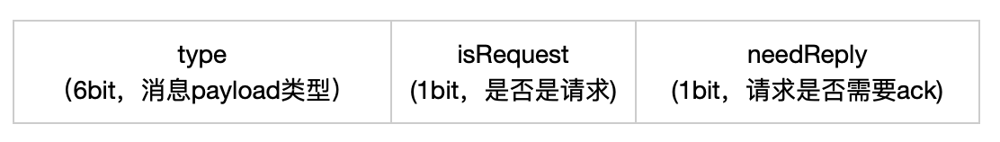

# simple-chat
## 项目简介
simple-chat是使用netty框架写的基于命令行的聊天服务，供大家学习netty使用。

#### 项目模块
simple-chat-server：聊天服务的服务端
simple-chat-client：聊天服务的客户端
simple-chat-component：聊天服务的公共组件

#### 协议

header：

payload类型

## 启动服务
运行：simple-chat-server模块下的 org.qianshan.chat.server.Server 类

## 启动客户端
运行：simple-chat-client模块下的 org.qianshan.chat.client.Client类

并输入用户名和密码（密码：qianshan）

## 演示
//todo

## 项目依赖
[netty](https://netty.io/)
[maven](https://maven.apache.org/)
[lombok](https://www.projectlombok.org/)

## 交流学习

